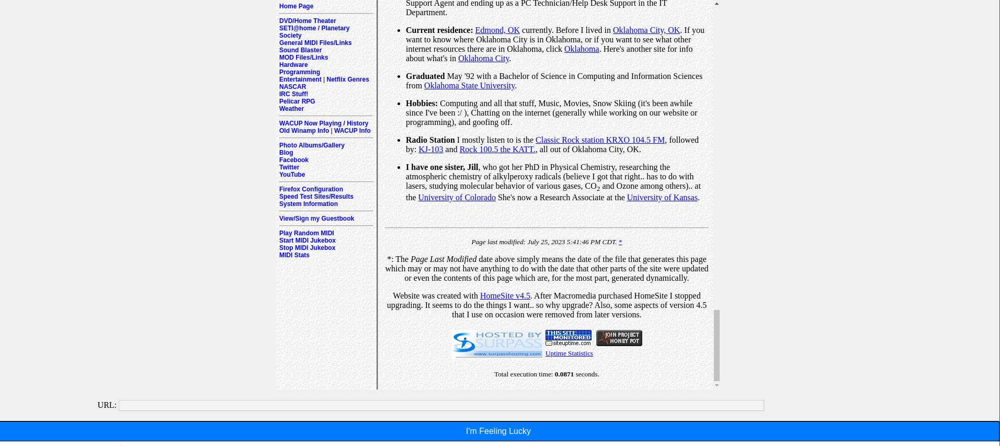

# I'm Feeling Lucky
This is a simple single page HTML + javascript applicaiton that wraps 
`http://wiby.me/surprise` into an embed element with an "I'm Feeling Lucky!" 
button for rapid, mindless, mobile browsing of the old web. All requests to 
`http://wiby.me/surprise` are made by the client. 

## Getting started
This is a single page html "application" that can be hosted with any web server
or opened with a broser locally.

There is a Dockerfile to host and run the app with: `make up`
